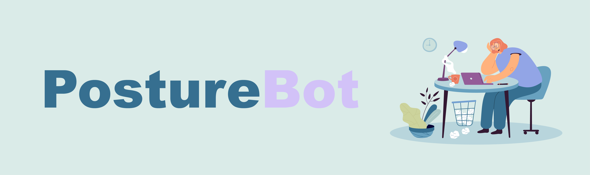

# AI

# 🤖 Posture Bot

Welcome! This is the repository for our Health Alert Network made for the subject AI. We worked on a robot that gives alerts about your position when your sitting behind a desk. 

# 📝 The concept

With the help of Posture Bot you can correct your sitting posture while working behind a laptop. With the help from Teachable Machine we make machine- learning models that see whenever your sitting posture isn't correct. It then gives a notification on how to fix your position.

# How to use PostureBot

The bot is made for people who sit behind a desk with back problems, that need a reminder when their sitting posture isn't correct. So that when your working on your laptop, the bot will give you a notifications when you need to fix your sitting posture.

You start the Bot by pressing the "start button". Afterwards you need to give the camera permission to record you while using the application. The application will continue to run in the background. When the trained Bot recognizes your posture is wrong, it will give you a notification on how to fix that posture. It will look like [this](https://github.com/MarkvHeusden/AI/wiki/Het-toekomstige-product). 

# How to make your own personalized PostureBot

> **NOTE:** Knowing the basics of Javascript will be beneficial. 

- Step one: train the computer to recognize your posture. 
- Step two: implement the trained bot into your own code. 

For a more comprehensive guide, please refer to our [wiki](https://github.com/MarkvHeusden/AI/wiki/Prototype)

# Technologies

PostureBot makes use of the following technologie:

- [Teachable Machine](https://teachablemachine.withgoogle.com)

# License

MIT License
